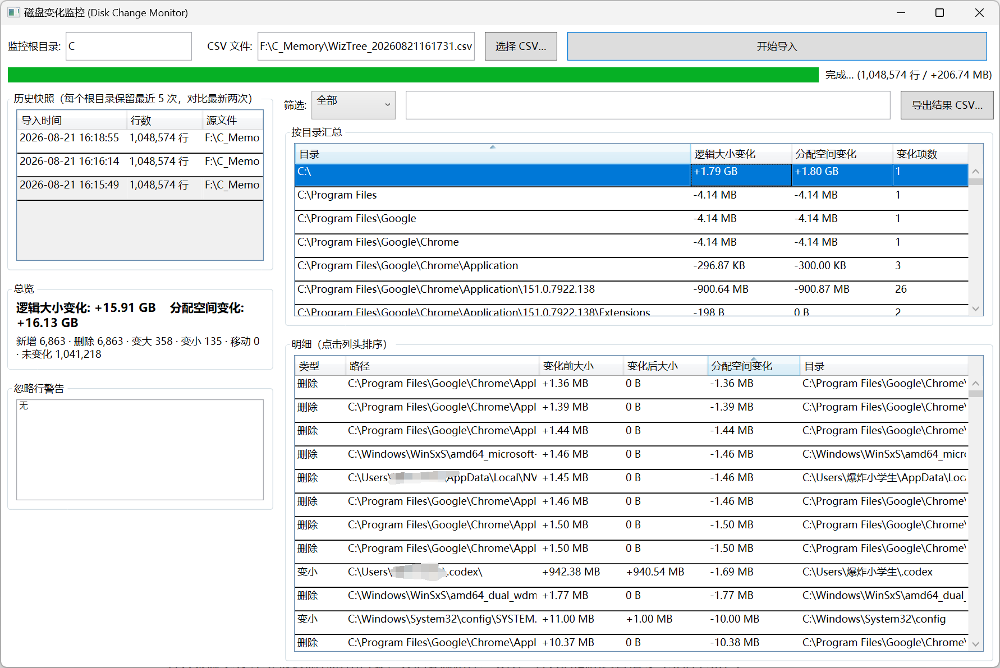

# 磁盘变化监控 (Disk Change Monitor)
(导入文件的进度条没设置好，看上去卡住了，实际没有，不影响使用）
一个本地 Windows 应用：手动导入 [WizTree](https://www.wiztree.com/) 导出的 CSV 快照，自动保留每个监控根目录最近 **5 次** 完成导入，并对比 **最新两次** 快照，展示每个文件/文件夹在**逻辑大小（大小）**和**占用空间（分配）**上的变化。



## 功能

- 手动选择 WizTree CSV 文件导入，启动时不扫描、不自动导入。
- 流式解析：280 MB 级 CSV 也能导入，内存占用有界（不会一次性载入整个文件）。
- SQLite 本地存储（`%LOCALAPPDATA%\DiskChangeMonitor\snapshots.db`），事务式提交，失败的导入不会影响历史。
- 按目录汇总 + 文件明细，支持按类型（新增 / 删除 / 变大 / 变小 / 移动）和路径关键字筛选。
- 移动/重命名检测基于路径 + 元数据匹配（大小、占用、修改时间、类型）。
- 对比结果可导出为 UTF-8 CSV。
- 所有数据都保存在本地；不读取被监控文件的内容，不上传任何数据。

## 使用

1. 用 WizTree 扫描 `C:\`（或其它磁盘/文件夹），然后 **导出 CSV**（UTF-8 中文版表头：`文件名称,大小,分配,修改时间,属性,文件,文件夹`）。
2. 打开本程序，确认“监控根目录”（默认 `C:\`）。
3. 点击 **选择 CSV…** 选中导出文件，点击 **开始导入**。
4. 首次导入只有历史记录；再次导入后即显示最新两次快照的对比结果。
5. 需要时点击 **导出结果 CSV…** 保存对比明细。

> 提示：对比只针对**最新两次**已完成导入。每个根目录最多保留 5 次导入，更早的会自动清理。

## 已知限制

- 移动/重命名检测是路径/元数据级的：CSV 中没有稳定文件 ID，因此“移动后又修改了大小”的项目会显示为“删除 + 新增”。
- 导入来源 CSV 不会被复制到应用目录，只记录源路径、大小、导入时间和内容指纹（SHA-256）。
- 程序要求 64 位 Windows 和 .NET 8 桌面运行时（自包含发布则无需安装运行时）。

## 构建与发布

```powershell
# 需要 .NET 8 SDK
dotnet restore DiskChangeMonitor.sln
dotnet test DiskChangeMonitor.sln --no-restore

# 自包含 win-x64 发布（输出目录见发布配置）
dotnet publish src/DiskChangeMonitor/DiskChangeMonitor.csproj -c Release -r win-x64 --self-contained true -p:PublishProfile=win-x64
```

发布后的可执行文件位于 `src/DiskChangeMonitor/bin/Release/net8.0-windows/win-x64/publish/DiskChangeMonitor.exe`。

## 测试

`dotnet test` 覆盖：CSV 解析（UTF-8/BOM、中文引号路径、科学计数法、本地化日期、坏行跳过）、SQLite 存储（事务、回滚、5 次保留、10k 行批量写入）、对比引擎（各类变化、移动配对、目录汇总）、导入流程（指纹、取消清理、最新两次对比）、CSV 导出与视图模型。详见 [docs/test-plan.md](docs/test-plan.md)。
